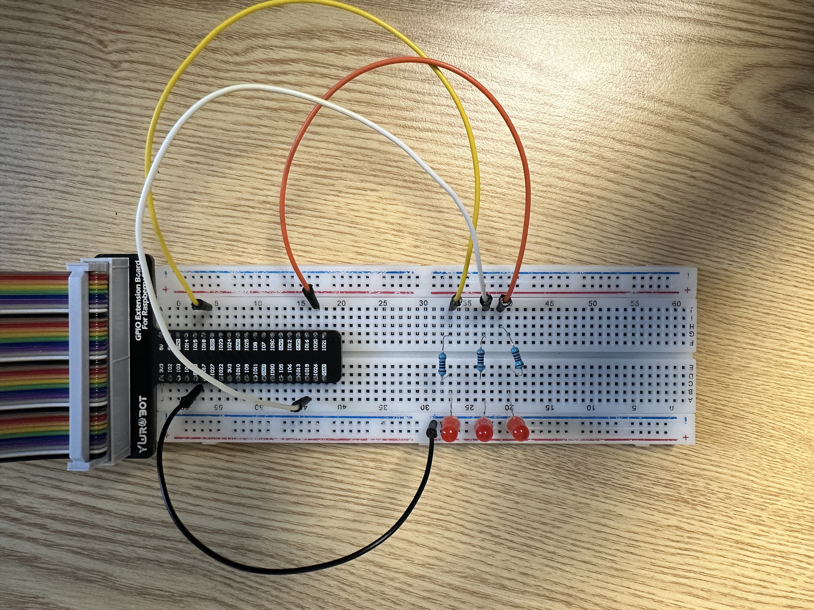

# GPIO 3비트 LED 출력 스크립트
유튜브 : https://youtu.be/2JtRtnm-wJ8

이 프로젝트는 Raspberry Pi의 GPIO 핀 3개를 이용해  
0부터 7까지의 숫자를 **3비트 이진수 형태로 LED로 출력**하고, 이 과정을 **반복**하는 Bash 스크립트입니다.

간단한 비트 연산과 GPIO 제어를 통해 디지털 회로의 동작을 직접 눈으로 확인할 수 있는 교육용/실습용 프로젝트입니다.

---

## 🔌 사용 핀

| 비트 역할 | GPIO 핀 번호 |
|-----------|---------------|
| LSB (2⁰)  | GPIO 18       |
| 중간 비트 (2¹) | GPIO 19   |
| MSB (2²)  | GPIO 20       |

---
## 🔧 회로 구성도

아래 이미지는 3비트 카운터 회로 연결 구성입니다.


---

## 🛠️ 실행 방법

1. 스크립트에 실행 권한 부여

```bash
chmod +x counter
```
2.	스크립트 실행
```bash
./counter
```
## 📜 코드 설명
```bash
pinctrl set 18 op
pinctrl set 19 op
pinctrl set 20 op
```
• GPIO 18, 19, 20번 핀을 출력 모드(output) 로 설정합니다.
```bash
for i in {0..7}; do
```
• 0부터 7까지의 정수를 하나씩 반복하면서 이진수 LED 표현을 수행합니다.
```bash
bit0=$(( (i >> 0) & 1 ))
bit1=$(( (i >> 1) & 1 ))
bit2=$(( (i >> 2) & 1 ))
```
• i 값을 오른쪽으로 이동(>>)하고 & 1을 사용해 각 비트를 추출합니다.
• 각각의 비트는 0 또는 1이며, 그 결과를 각 GPIO 핀에 대응시킵니다.
```bash
[ $bit0 -eq 1 ] && pinctrl set 18 dh || pinctrl set 18 dl
```
• 추출한 비트가 1이면 해당 GPIO 핀을 dh(high)로 설정해 LED를 켜고,
• 0이면 dl(low)로 설정해 LED를 끕니다.
```bash
sleep 1
```
---
## 💡 결과 예시
| i 값 | 이진수 | GPIO 20 (MSB) | GPIO 19 (중간) | GPIO 18 (LSB) | LED 상태 예시   |
|------|--------|----------------|----------------|----------------|------------------|
| 0    | 000    | off            | off            | off            | ● ● ●            |
| 1    | 001    | off            | off            | on             | ● ● 🔴           |
| 2    | 010    | off            | on             | off            | ● 🔴 ●           |
| 3    | 011    | off            | on             | on             | ● 🔴 🔴          |
| 4    | 100    | on             | off            | off            | 🔴 ● ●           |
| 5    | 101    | on             | off            | on             | 🔴 ● 🔴          |
| 6    | 110    | on             | on             | off            | 🔴 🔴 ●          |
| 7    | 111    | on             | on             | on             | 🔴 🔴 🔴         |